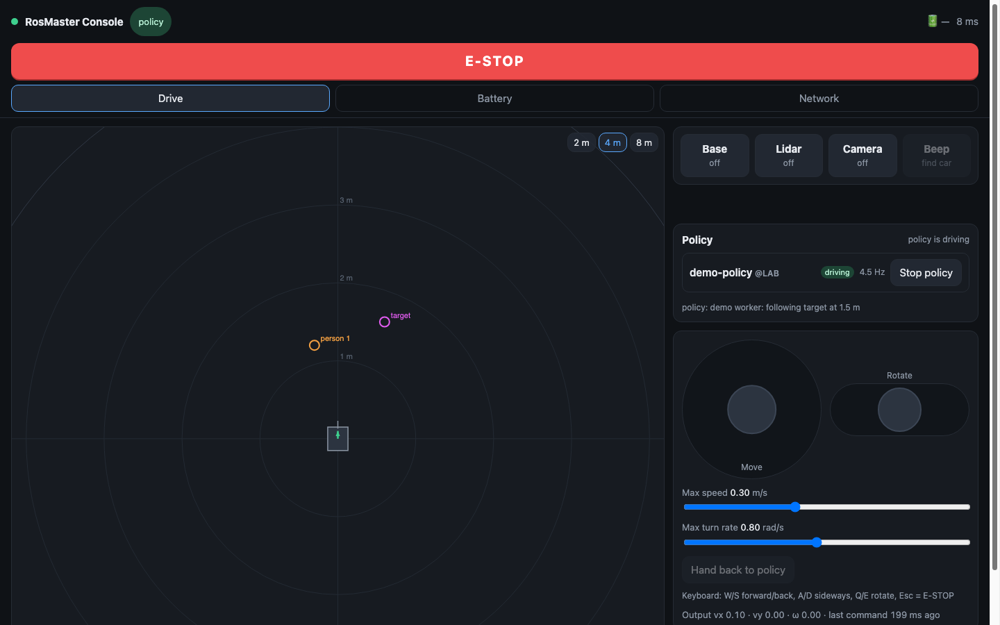
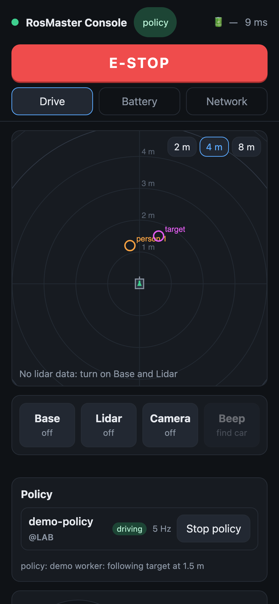

# Dashboard guide

The dashboard is a web page served by the car at port 8080. Open it in any browser on the same network: `http://rosmaster.local:8080`, `http://<car IP>:8080`, or `http://192.168.1.11:8080` when you are on the car's own hotspot. Several people can have it open at the same time. It works on phones: the layout switches to a single column.

*The screenshot was taken on a test hub without the car (see [OPERATIONS.md](OPERATIONS.md#test-hub-without-the-car)), so no lidar points are shown. The two circles are debug markers sent by a demo policy.*

## Always visible

| Element | Meaning |
|---|---|
| Green or red dot | Green: the page is connected to the car. Red, plus a yellow "Lost connection" banner: it is not, and it keeps retrying. |
| Mode chip | Who is driving. **idle**: nobody. **manual**: someone using the joystick or keyboard. **policy**: a policy program (see [POLICY.md](POLICY.md)). **E-STOP**: stopped and locked. |
| 🔋 chip | Estimated charge and voltage. Yellow means low, red means very low. Click it to open the Battery tab. |
| `xx ms` | Round trip time from this page to the car. Normally 10–30 ms on Wi-Fi. |
| **E-STOP** | Stops the car at once and keeps it stopped until someone presses **Release E-STOP** in the red banner. It works from any open dashboard, including other people's. The Esc key does the same. |
| Footer | Lidar and odometry rates, number of open dashboards, current network and IP, free disk, CPU temperature, hub uptime. |

## Drive tab

*Drive tab on a phone (test hub, no sensors on). The orange and magenta circles are debug markers from a demo policy.*

### Top-down view (left on a laptop, top on a phone)

The car is the grey rectangle in the middle, facing up. Rings are 1 m apart; the **2 m / 4 m / 8 m** buttons zoom. Yellow dots are lidar points, one per laser reading of the latest scan (about 7 scans per second). The **green arrow** is the velocity the hub is commanding and the **blue arrow** is the velocity measured by odometry, drawn at a scale of 1 m/s = 1 m. Coloured circles, when present, are markers sent by the policy that is running.

### Sensors

| Button | What it starts | Typical start time |
|---|---|---|
| **Base** | The wheel driver, IMU filter and odometry (EKF). Needed for driving. | about 2 s |
| **Lidar** | The laser scanner, including its motor. | 4–10 s; if the start fails it automatically replugs the lidar's USB and retries, up to 3 times |
| **Camera** | The colour camera stream (shown under the top-down view) | about 1 s |
| **Beep** | Short beep, to find the car. Needs Base on. | — |

The states are: **off**, **starting** (with the attempt number), **on** and **error** (with a message below the buttons). Press a button again to switch the sensor off; press an **error** button to retry. "Off" really is off: the lidar motor stops and the camera is released. After 10 minutes with no dashboard open and no policy in control, the hub switches all sensors off by itself.

### Policy card

This card lists the policy programs ("workers") that are connected to the car, showing each one's name, host, command rate and latency. Each row has one button:
- **Give control**: this worker's commands start driving the car. The mode changes to **policy**.
- **Stop policy**: control is taken back and the car stops.

Touching the joystick or keyboard while a policy drives takes over immediately. The mode becomes **manual** and the policy's commands are ignored. Press **Hand back to policy** to give control back. After an E-STOP the policy does not resume on its own. Writing a policy is covered in [POLICY.md](POLICY.md).

### Manual driving

- **Move joystick** (left): up is forward, down is back, left and right move sideways.
- **Rotate** (right): drag left to turn left, right to turn right.
- **Keyboard** (desktop): W/S, A/D, Q/E; Esc triggers E-STOP.
- **Max speed** and **Max turn rate** scale the joysticks. They are remembered by the browser. The car itself never exceeds 0.7 m/s or 1.5 rad/s, and it limits acceleration to 1.5 m/s². Slowing down is never limited.
- **Exit manual / Hand back to policy**: ends manual mode, returning to idle or to the policy that had control.
- The **Output** line shows the command actually sent to the wheels.

## Battery tab

- **Big number and bar**: the estimated charge. The ticks mark the 9.6 V alarm, the 10.0 V "finish" line, the 10.5 V warning and 12.6 V (full). The dashed box is the 11.1–11.7 V range for long-term storage.
- **Discharging**: at the drain rate measured over the last 15 minutes at rest, how long until each line is reached. It needs about 5 minutes of data first. It also lists which sensors are on, because they drain the battery faster.
- **Charging**: an estimate of the time to full. The car cannot measure this, because it must be switched off while charging. The estimate is based on the capacity and charger current you type in (defaults: 6000 mAh and 2 A, both unverified).
- **Voltage history**: up to 3 hours. The blue line is the resting voltage. The grey line is readings taken while driving, which the load pulls down.
- **Details**: every raw value, and where the numbers come from.

The hardware reports only voltage, so the percentage is an estimate. The pack chemistry is also unconfirmed: check the label on the pack (INR = NMC lithium-ion, which the estimate assumes; ICR or a flat pouch = LiPo). With **Base** off, the hub still reads the voltage directly from the chassis board.

## Network tab

This tab puts the car on a Wi-Fi network. The car has no keyboard, so this is the normal way to connect it in a new place.

| Section | Use |
|---|---|
| **Current network** | Mode (car's hotspot or Wi-Fi), network name, car IP and dashboard addresses. **Switch to the car's hotspot** makes the car leave the network and open `ROSMASTER`. Press twice to confirm, because every dashboard on the current network loses the car. |
| **Nearby Wi-Fi** | Press **Scan** (takes 5–10 s). Each network shows signal, band and security. **Connect** opens a password box. Saved networks can be left empty. For a hidden network, use "Type a network name". |
| **Saved networks** | Networks the car remembers, by priority. **Delete** removes one (press twice). The hotspot and the network in use cannot be deleted. |

### How a switch works

1. You press **Connect**. The car replies at once, then switches about 1.5 s later, which takes 10–45 s.
2. A window explains what to do. If you came in over the `ROSMASTER` hotspot, the hotspot disappears and your laptop loses the car. That is expected.
3. Move your laptop or phone to the same network as the car. The window keeps looking for the car at `rosmaster.local`, and also at the IP the car had on that network last time. When it finds the car on the new network, it opens the dashboard there by itself.
4. **If the switch fails** (wrong password, network gone), the car undoes the change and goes back to the network it was on. If that network is not reachable either, it opens the `ROSMASTER` hotspot. Either way you can always reach it again. The window shows the reason if the car is still reachable from where you are.

### Which network the car picks after power-on

Each saved network has a priority. The car joins the highest-priority network that is in range:

| Network | Priority |
|---|---|
| `TASL` (lab) | 100 |
| `TP-Link-1700` (Litian's home) and networks added in this tab | 60 |
| Car's own hotspot `ROSMASTER` | 50 |
| Everything else the car has saved (`IOTUCR`, `bcoedean`, …) | 0 |

The hotspot is always "in range", so a saved network with priority below 50 is never chosen over it. Pressing **Connect** on a network in this tab raises its priority to 60. For a network the car already knows, the password can be left empty.

### Typical situations

| Situation | What to do |
|---|---|
| Lab, network `TASL` in range | Nothing: the car joins `TASL`. Put your laptop on `TASL` too. |
| Lab, car opened its hotspot anyway | `TASL` was not in range. Join `ROSMASTER`, open `http://192.168.1.11:8080`, and in the Network tab **Connect** to the lab network you use, with its password (ask lab members). The older setup used `TASL_5G-1`, where the car got `192.168.50.21`. From then on the car prefers that network over the hotspot. |
| New place, the car and your laptop can use the same Wi-Fi | Join `ROSMASTER`, open `http://192.168.1.11:8080`, go to Network, **Connect** to the local Wi-Fi, then move your laptop to it. |
| Campus network that needs a login (e.g. UCR-SECURE) | Not supported: WPA/WPA2-Personal and open networks only. Use the car's hotspot, or a phone hotspot that both devices join. |
| The network blocks traffic between devices (dashboard does not open even by IP) | Use the car's hotspot. |
| `rosmaster.local` does not resolve but the IP works | The network blocks mDNS. Use the IP from the OLED screen. |

tasl-l1 has only one Wi-Fi card. While it is connected to the car's hotspot, it has no internet unless you plug in an Ethernet cable. See [TERMINAL.md](TERMINAL.md#tasl-l1-on-two-networks).

## Troubleshooting

| Symptom | Likely cause and fix |
|---|---|
| Page does not open at all | Wrong network, or the car is still booting (allow 2 minutes). Try the OLED IP, or the hotspot. Then see [TERMINAL.md](TERMINAL.md). |
| Red dot and "Lost connection" | The car left this network (Wi-Fi switch, power) or the hub restarted. The page reconnects by itself when the car is reachable again. |
| **Lidar** stays in **error** after 3 attempts | Its USB serial adapter sometimes stops responding. Press it again; if it keeps failing, unplug and replug the lidar's USB cable. See [OPERATIONS.md](OPERATIONS.md#known-issues). |
| **Base** error "Another chassis driver is running" | The old Yahboom container `x3` is running. Stop it: `docker stop x3` (see [TERMINAL.md](TERMINAL.md)). |
| Base on, but a yellow note about `/odom` | You can drive, but measured speed is not shown. Switch Base off and on again. |
| Joystick does nothing | Check the mode chip: **E-STOP** must be released first. Base must be **on**. |
| Car stops by itself | Something sent an E-STOP (the reason is in the banner), the battery reached 9.0 V, or your browser tab went to the background (it stops sending commands). |
